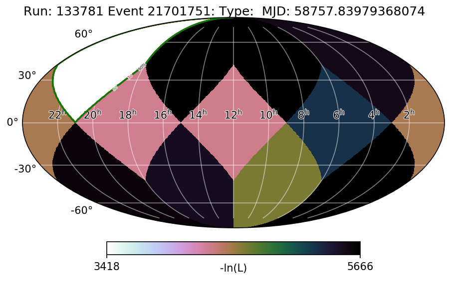

# Simple test case scan

This scan is a modified version of the one that is run in realtime. The scripts include variations not only in the definition of the scan, but also to be able to read an event as an i3 file (most likely in a not-very-efficient way). 

The event selected to test this is a simulated neutrino that resembles IC191001A.

## Repository

The repository contains all the scripts from the main skymap scanner that had to be modified to run this simple test case scan.

- `scans.sh`: loads the environment and runs the scan.
- `perform_scan.py`: mais script. It loads the event file (with functions from the scripts mentioned in the line below), sends the jobs to the cluster and stores the output.  
- `extract_json_mod.py` and `extract_i3_file.py`: read the event from an i3file (the later script comes from the AWS version of the scanner) and the GCD file.
- `choose_new_pixels_to_scan.py`: creates the healpix map that will be used in the scan
- `create_plot.py`: creates a LLH skymap

- `output_skymap_scanner/`: output of the scan 

- `Level2_IC86.2019_data_Run00133119_1001_77_488_GCD.i3.zst`: GCD file
- `ic191001a_sim.i3`: event to scan

## Run the scan 

First load the environment with 

```
eval `/cvmfs/icecube.opensciencegrid.org/py3-v4.1.0/setup.sh`
/cvmfs/icecube.opensciencegrid.org/users/followup/metaprojects/combo-realtime/trunk/build/env-shell.sh
```

Then you run the scan with 

```
python perform_scan.py -r "ssh submitter" -n 30 ic191001a_sim -c /path/to/output_skymap_scanner --event /path/to/ic191001a_sim.i3 --gcd_dir /path/to/Level2_IC86.2019_data_Run00133119_1001_77_488_GCD.i3.zst
```

or simply run `scans.sh`, which will do both things for you. With this version of the scanner (nside=1 and 30 jobs, set with the `-n` tag) it takes ~11min to run a scan. The output files will be stored in `output_skymap_scanner/` with the same format as with the production scanner (each pixel is stored in an individual i3 file). If you want to plot a skymap of the scan, do

```
python create_plot.py ic191001a_sim -c output_skymap_scanner
```

and you will get a png that looks like 

